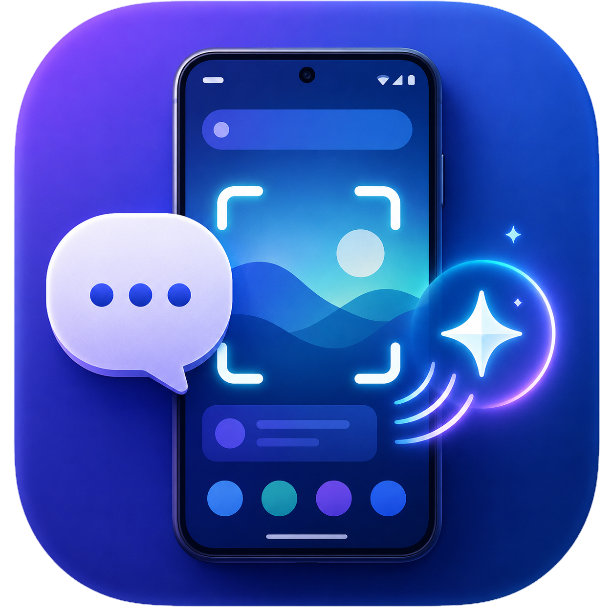

<div align="center">



# Overlay AI

**どのアプリの上からでも呼び出せる、Android 向けフローティング AI チャット**

ChatGPT のサブスク枠（Codex OAuth）を直接利用するため、API キー不要。
画面共有・Web 検索・サンドボックス shell・スキル機構がすべて端末内で完結します。

[](LICENSE)


</div>

> [!IMPORTANT]
> 本アプリは OpenAI および Anthropic とは関係のない非公式プロジェクトです。ログインした ChatGPT アカウントの利用枠を消費します。利用にあたっては各サービスの利用規約をご確認ください。詳細は [免責事項](#免責事項) を参照してください。

---

## 特徴

- **フローティングバブル UI** — 画面最前面に常駐する「＋」バブルから、いつでも縦長チャットパネルを展開可能。他アプリの操作を遮らずに並行利用できます。ドラッグ移動に対応し、画面端のゴミ箱アイコンへ重ねることで終了します。
- **API キー不要** — 端末上で ChatGPT アカウントに直接 OAuth ログイン（PKCE・ループバック）。Codex の `responses` エンドポイント経由で**既存サブスクの利用枠を消費**するため、従量課金 API キーは不要です。
- **画面共有** — 「画面送信」を有効にすると `MediaProjection` で端末画面をキャプチャして添付。表示中の画面を見せながら質問できます（キャプチャ時はバブルやパネルを自動で一時非表示）。
- **Web 検索（常時）** — `web_search` ツールを常時有効化し、最新の Web 情報を参照した回答に対応。
- **サンドボックス shell エージェント** — アプリ専用領域のワークスペースに限定された `shell` ツールを搭載。ファイル生成や加工処理をエージェントループ内で自律的に実行します。
- **スキル機構** — Claude / Codex 互換の `SKILL.md` 形式に対応。zip 形式でスキルを追加すると、モデルが必要に応じて読み込み・実行します。コンテキスト消費を抑えるため、初期プロンプトにはメタデータのみを注入する Progressive Disclosure 方式を採用。
- **完全オンデバイス** — 外部の中継サーバーやブリッジ用 PC は不要。認証情報は `EncryptedSharedPreferences` で端末内に暗号化保存されます。DNS は DoH（Cloudflare）フォールバックに対応。

## 仕組み

```
┌────────────────────────── Android 端末 ──────────────────────────┐
│                                                                  │
│  MainActivity (Jetpack Compose ダッシュボード)                   │
│    ├─ オーバーレイ権限 / ChatGPT ログインのゲーティング          │
│    └─ スキル管理・各種設定                                       │
│                                                                  │
│  OverlayService (前面サービス / SYSTEM_ALERT_WINDOW)             │
│    ├─ バブル FAB（ドラッグ・ゴミ箱）                             │
│    ├─ OverlayWebHost ─ WebView パネル                           │
│    │     └─ webui (React + Tailwind + shadcn/ui)                │
│    ├─ ScreenCapture (MediaProjection)                           │
│    └─ SkillManager (filesDir/skills, filesDir/workspace)        │
│                                                                  │
│  DirectCodexClient                                              │
│    └─ POST chatgpt.com/backend-api/codex/responses (SSE)        │
│         tools: web_search, shell(function)  /  agent loop       │
│                                                                  │
│  CodexAuth ── PKCE ループバック OAuth → EncryptedSharedPrefs     │
└──────────────────────────────────────────────────────────────────┘
```

チャット UI は WebView 上の React アプリとして動作し、ネイティブ側とは JavaScript Bridge 経由で連携します。モデル呼び出しは Codex の Responses スキーマ（ステートレス、`store:false`、`reasoning.encrypted_content` のインライン返却）に準拠しています。

## 動作要件

- Android 8.0 (API 26) 以上
- ChatGPT アカウント（ログインに使用）
- 「他のアプリの上に重ねて表示」権限

## 技術スタック

| 領域 | 採用技術 |
| --- | --- |
| ネイティブ | Kotlin, Jetpack Compose（ダッシュボード）, WebView（チャット） |
| チャット UI | Vite + React + TypeScript + Tailwind CSS + shadcn/ui |
| 通信 | OkHttp 4.12 + okhttp-dnsoverhttps（DoH フォールバック）, SSE |
| 認証/保存 | AndroidX Browser, Security-Crypto（EncryptedSharedPreferences）|
| 画面取得 | MediaProjection API |
| ビルド | Android Gradle Plugin 8.5.2 / Gradle 8.7 / JDK 21 |

## ビルド方法

### 前提

- JDK 21
- Android SDK（`platforms;android-35`, `build-tools;35.0.0`）
- Node.js 18 以上（チャット UI のビルド用）

### 1. チャット UI（webui）をビルド

```bash
cd webui
npm install
npm run build
# 生成物 (dist/) を app/src/main/assets/webui/ へ配置
```

> `vite.config` の `outDir` をアプリの assets に向けておくと、コピー手順を省けます。

### 2. APK をビルド

```bash
./gradlew :app:assembleDebug
# 出力: app/build/outputs/apk/debug/app-debug.apk
```

端末にインストール後、初回起動時にオーバーレイ権限の許可と ChatGPT ログインを行えばセットアップ完了です。

## 使い方

1. **初期設定**: ダッシュボードでオーバーレイ権限を許可し、ChatGPT にログインします。
2. **オーバーレイ起動**: 「オーバーレイを開始」をタップすると、画面最前面にバブルが表示されます。
3. **チャットパネルの操作**: バブルをタップしてパネルを展開。長押しでパネルごと移動、ピンチ操作でサイズ変更が可能です。
4. **画面共有**: 表示中の画面について質問したい場合は「画面送信」をオンにします。
5. **最小化・終了**: ヘッダーの **−** で最小化（状態保持）、**×** でパネルを終了。バブルを画面下のゴミ箱へドラッグすることでも終了できます。

## スキルを追加する

Claude / Codex 互換の `SKILL.md` を含むフォルダを zip 化し、ダッシュボードの「スキル」→「スキルを追加」から取り込みます。

```
my-skill/
├─ SKILL.md            # name / description のフロントマター + 手順
├─ references/         # モデルが必要時に読む補足
├─ templates/          # 再利用するひな形
└─ scripts/            # 実行スクリプト（端末内 shell で動くもの）
```

```markdown
---
name: my-skill
description: スキルの概要や発火条件（トリガー）を記述
---

# My skill
実行手順をここに記述。スクリプトは `sh ./skills/my-skill/scripts/xxx.sh` のように
ワークスペース直下からの相対パスで呼び出します。
```

> 端末側の shell は toybox ベースのため、`python` / `node` 等は使えません。スクリプトは POSIX `sh` + 標準コマンドで完結させてください。

## 設定

- **ワークスペースのリセット** — 起動時に作業領域を自動初期化するかどうかを設定可能。
- **モデル** — `gpt-6-sol` / `gpt-6-astra` / `gpt-6-luna` / `gpt-5.6-sol` / `gpt-5.5` / `gpt-5.4` / `gpt-5.3-codex` / `gpt-5-codex-mini` / `o3` などから選択可能（利用可能なモデルはアカウントのプランに依存）。

## プライバシー / セキュリティ

- 認証トークンは `EncryptedSharedPreferences` で端末内に暗号化保存され、外部の中継サーバー等へ送信されることはありません。
- shell ツールはアプリ専用の作業ディレクトリ内でのみ動作します。
- 画面キャプチャは「画面送信」を明示的に有効にした場合のみ実行されます。

## 免責事項

本ソフトウェアは OpenAI および Anthropic とは一切関係のない、非公式・無保証のプロジェクトです。利用は自己責任で行ってください。これに起因するアカウント上の問題や損害について、作者は責任を負いません。各サービスの利用規約を遵守できる範囲でご利用ください。

## ライセンス

[MIT License](LICENSE) © 2026 mokouliszt

